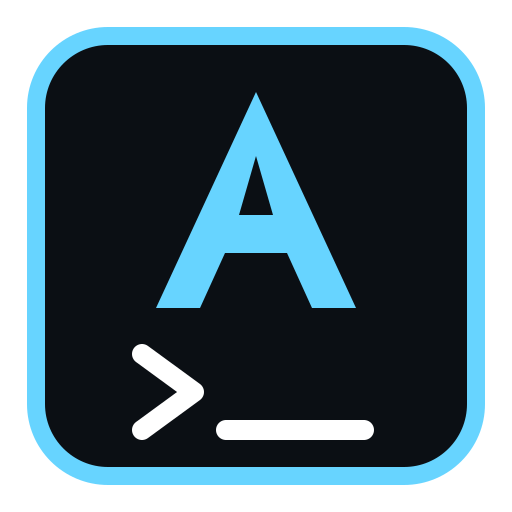
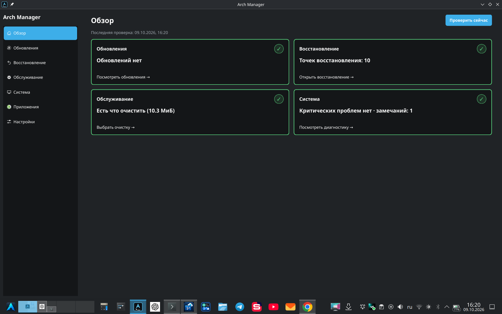
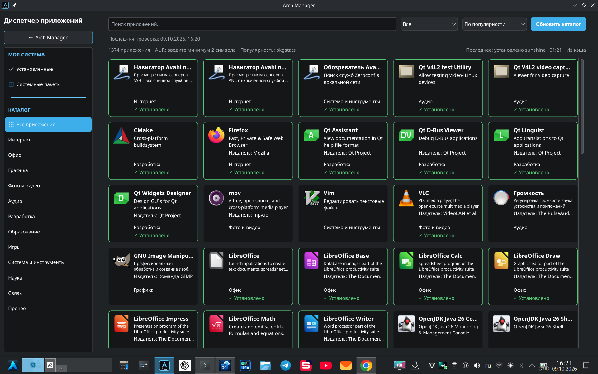
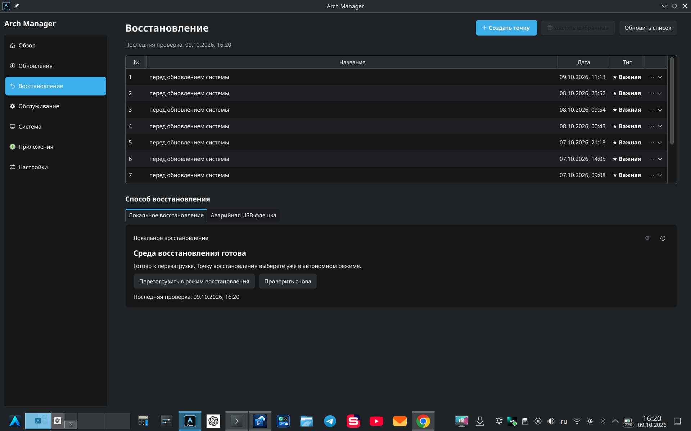
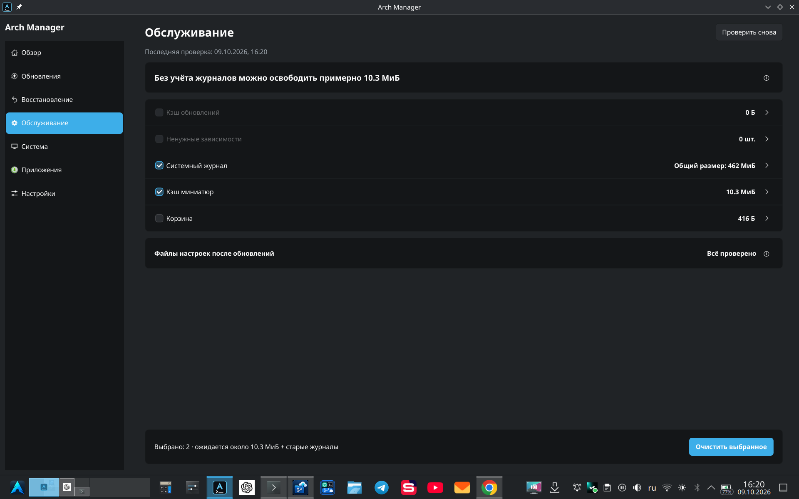
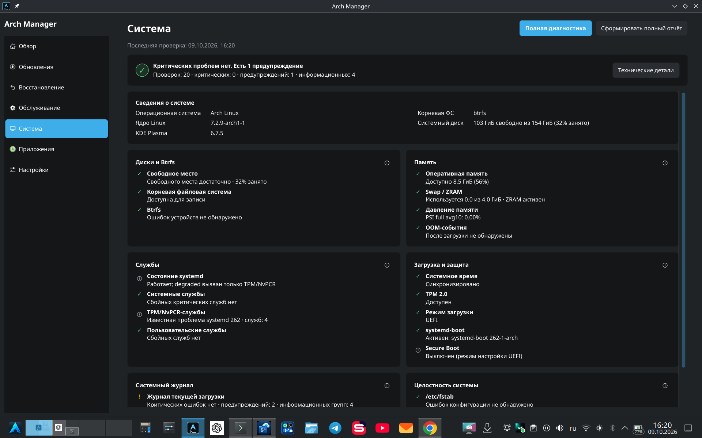

<div align="center">
  
  <h1>Arch Manager</h1>
  <p>Обновления, приложения и обслуживание Arch Linux — в одном окне.</p>
  <p><strong>0.7.0-beta.1 · Предварительная версия · Python / Qt</strong></p>
  <p>
    <a href="https://github.com/tzkwork-sys/arch-manager/releases/download/v0.7.0-beta.1/arch-manager-0.7.0beta1-1-any.pkg.tar.zst"><strong>⬇ Скачать для Arch Linux (.pkg.tar.zst)</strong></a> ·
    <a href="docs/INSTALL.md">Установка</a> ·
    <a href="CHANGELOG.md">Изменения</a> ·
    <a href="CONTRIBUTING.md">Участие в разработке</a> ·
    <a href="https://github.com/tzkwork-sys/arch-manager/issues">Сообщить об ошибке</a>
  </p>
</div>

---

**Arch Manager** — графическое приложение для управления Arch Linux. Оно
объединяет системные обновления, каталог приложений, точки восстановления,
диагностику и обслуживание, используя стандартные инструменты системы.

> **Статус выпуска:** первая публичная бета-версия `0.7.0-beta.1`.
> Проверка установки на чистой системе и испытания Recovery ещё впереди.
> Это не обещание стабильности или поддержки любой конфигурации Arch.

## Скачать для Arch Linux

**Готовый установочный пакет для Arch Linux x86_64 (KDE Plasma и другие окружения с Polkit).**

**[⬇ Скачать Arch Manager 0.7.0 Beta — пакет Pacman (.pkg.tar.zst)](https://github.com/tzkwork-sys/arch-manager/releases/download/v0.7.0-beta.1/arch-manager-0.7.0beta1-1-any.pkg.tar.zst)**

[Скачать контрольные суммы SHA-256](https://github.com/tzkwork-sys/arch-manager/releases/download/v0.7.0-beta.1/SHA256SUMS.txt) · [Все файлы выпуска и исходники](https://github.com/tzkwork-sys/arch-manager/releases/tag/v0.7.0-beta.1)

Это **бета-версия**. После скачивания обоих файлов откройте терминал в папке загрузок:

```bash
sha256sum --check --ignore-missing SHA256SUMS.txt
sudo pacman -Syu
sudo pacman -U ./arch-manager-0.7.0beta1-1-any.pkg.tar.zst
arch-manager-gui --check
```

Запускайте **Arch Manager** через меню приложений **без sudo**. Если ранее устанавливали Arch Manager из исходников, **не выполняйте `pacman -U` до проверки конфликта старых helpers и ярлыков** — [инструкция перехода](packaging/arch/README.md#переход-с-установки-из-исходников). Recovery в пакет не входит.

## Скриншоты

### Обзор



<details>
<summary>Ещё скриншоты: приложения, восстановление, обслуживание и система</summary>

### Приложения



### Восстановление



### Обслуживание



### Система



</details>

## Возможности

| Раздел | Что можно делать |
| --- | --- |
| **Обзор** | Смотреть состояние системы, обновлений и обслуживания. |
| **Обновления** | Проверять и устанавливать официальные обновления и выбранные AUR-пакеты в одном разделе. |
| **Приложения** | Искать официальные и AUR-приложения, просматривать установленные приложения и системные пакеты. |
| **Восстановление** | Создавать и удалять точки Snapper; готовить экспериментальную локальную или USB Recovery-среду. |
| **Обслуживание** | Очищать кэш пакетов, ненужные зависимости, журнал и пользовательские кэши. |
| **Система** | Просматривать сведения и диагностику, включая дополнительные SMART/NVMe-проверки. |
| **Настройки** | Настраивать доступные параметры и смотреть журнал действий. |

GUI работает от обычного пользователя. Для системных изменений используются
ограниченные системные компоненты и авторизация администратора. Обновление
официальных пакетов выполняется целиком, без отдельного частичного обновления
приложений. AUR требует `yay` и внимательного просмотра его вопросов и PKGBUILD.

## Начало работы

**Целевая система:** Arch Linux x86_64. Основное окружение разработки — KDE Plasma.
Установочный пакет и команды приведены в разделе **«Скачать для Arch Linux»**.
Python, PySide6 и необходимые системные зависимости устанавливаются через Pacman.
Для AUR нужен `yay`, для Snapper — настроенная конфигурация; Recovery — отдельная экспериментальная подсистема.

Подробности, переход с установки из исходников, сборка и удаление — в [руководстве пакета Arch](packaging/arch/README.md).
Альтернативная установка из исходников описана в [INSTALL.md](docs/INSTALL.md).

## Важно о восстановлении

**Recovery пока экспериментален и рассчитан на ограниченную конфигурацию.**

Для локального режима нужны Btrfs-корень `@`, `@snapshots` в `/.snapshots`,
systemd-boot с ESP в `/boot` и `/data/Arch-Recovery` на другом блочном устройстве,
не на устройстве корня. Поддержка GRUB, ext4, шифрованных схем и Secure Boot
не заявляется.

- Открытие раздела Recovery при выполненных условиях может запросить пароль,
  запустить сборку ISO и подготовить загрузочные файлы.
- **Создание Recovery-флешки уничтожает данные на выбранном накопителе.**
- Восстановление изменяет системный корень; его нельзя считать проверенным
  только на основании прохождения автоматических тестов.
- **Храните независимую резервную копию.** Snapshots на том же диске не защищают
  от отказа диска.

Подробнее: [ограничения установки](docs/INSTALL.md#recovery-limitations) и
[устройство Recovery](docs/STAGE_7.md).

## Сообщить об ошибке или предложить улучшение

Используйте [Issues](https://github.com/tzkwork-sys/arch-manager/issues) для ошибок
и предложений. Укажите версию приложения, окружение, шаги воспроизведения и
ожидаемый результат. **Удалите пароли, токены, личные пути и другие приватные
данные из журналов.**

Уязвимости не публикуйте в открытых Issues: см. [SECURITY.md](SECURITY.md).

Хотите помочь кодом? Сделайте fork и отправьте Pull Request по правилам
[CONTRIBUTING.md](CONTRIBUTING.md). Изменения в официальный проект принимает
владелец; открытая лицензия разрешает независимые изменения собственных копий.

## Для разработчиков

```bash
python -m venv .venv
source .venv/bin/activate
python -m pip install -r requirements-dev.txt
QT_QPA_PLATFORM=offscreen python -m pytest -q
```

Запуск из исходников: `bash scripts/run-gui.sh`.
Не запускайте установщики или реальные операции Recovery ради проверки PR.

| Документ | Назначение |
| --- | --- |
| [Архитектура](docs/ARCHITECTURE.md) | Структура приложения и границы системных компонентов. |
| [Подготовка выпуска](docs/RELEASE.md) | Проверки, обязательные перед публикацией. |
| [Changelog](CHANGELOG.md) | Изменения кандидата выпуска. |
| [История разработки](docs/README_HISTORY.md) | Архив старого README; не руководство по текущей версии. |

## Лицензия

**GPL-3.0-only.** См. [LICENSE](LICENSE). Приложение распространяется без гарантий.
Зависимости и отдельно обозначенные сторонние материалы сохраняют свои лицензии.
